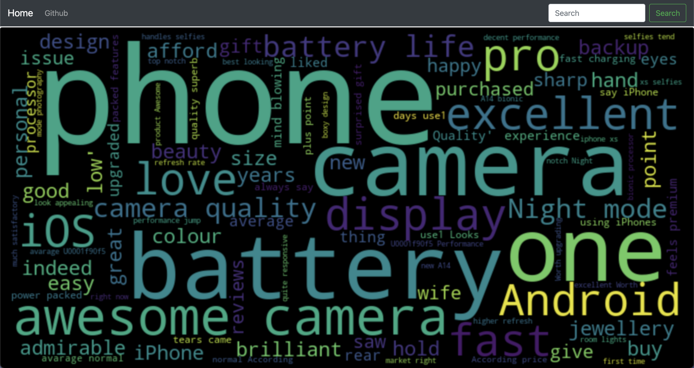
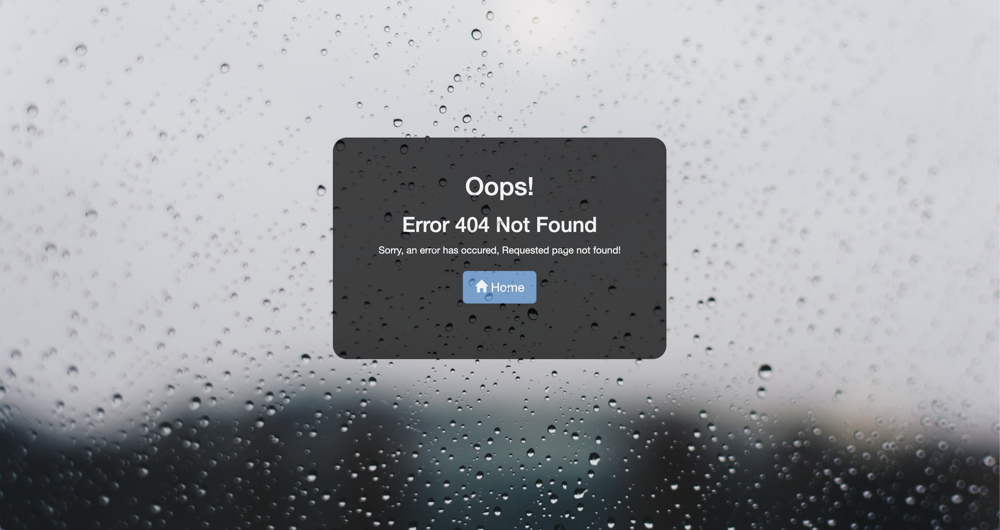

# Flask based wordcloud generator
A flask based application to scrap user reviews and comments from a retail website and generates wordcloud with CSV data.

**Live demo -**  
1. http://wordcloudgenerator-env-1.eba-vz3p32ek.us-east-2.elasticbeanstalk.com/
 
2. https://wordcloudgenerator.azurewebsites.net/
 
3. https://word-cloudgenerator.herokuapp.com/
 

## Screenshots from the project -
### 1. Homepage to search a product.

---

### 2.Tabular form of data available for download as well. 

---

### 3. Wordcloud of a product providing brief idea and functionalitites of a product.

---

### 4. Error page.

---

### 5. Phone view.

---

